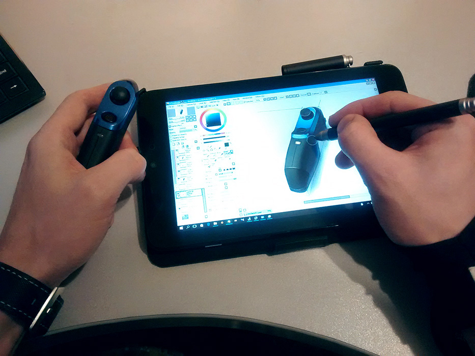

#ZeeClient

Unofficial Zeemote client for Windows OS.

##About

This small utility is designed for artists who want to draw on a Windows tablet with digitizer (such as Microsoft Surface, Asus Vivotab Note or Lenovo Thinkpad 2 etc).

If you've been using your Windows tablet for drawing or sketching on the go. Than you know, it's lack of hotkeys.

There might be number of  solutions for this problem. One of them is using of some kind of a Bluetooth keyboard or gamepad.

This particular app is a Windows client for Zeemote gamepad - a tiny Bluetooth gamepad for Android or iOS.

It allows to map Zeemote buttons to perform various shortcuts.

##Features

- Map Zeemote buttons to shortcuts with Ctrl, Alt and Shift
- Mouse wheel support
- Detect key down and key up events

##Requirements

- Windows XP or higher;
- .Net Framework 3.5 (usually pre-installed in OS);

##Libraries used
- 32feet.NET - Personal Area Networking for .NET http://32feet.codeplex.com/
- Windows Input Simulator https://inputsimulator.codeplex.com/

##License

The MIT License